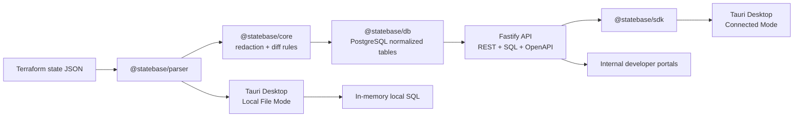

# StateBase

StateBase turns Terraform state files into a secure, queryable, versioned infrastructure database for platform engineering teams. It ingests Terraform state v4 JSON, normalizes resources into PostgreSQL tables, redacts sensitive values by default, exposes REST and SQL APIs, generates state-version diffs, and ships with a Tauri desktop application for connected and local-only workflows.

Terraform state contains valuable infrastructure truth, but most teams keep it trapped in flat JSON blobs in S3, GCS, Azure Blob, Terraform Cloud, or local backends. StateBase makes that data observable without pretending that state is low-risk data: sensitive fields are detected and redacted before persistence, API tokens are hashed, every SQL query is audited, and org/workspace scoping is enforced.

## Repository layout

```text
statebase/
  apps/
    api/          Fastify API server
    desktop/      Tauri + React desktop app
    web/          Lightweight web console shell
  packages/
    core/         Domain types, redaction, diffing, query sandbox, drift interfaces
    parser/       Pure TypeScript Terraform state v4 parser
    db/           PostgreSQL schema, migrations, seed, repositories, query execution
    sdk/          TypeScript SDK and CLI
    ui/           Shared UI helpers/theme tokens
  fixtures/       tfstate fixtures used by tests and demos
```

## Architecture



Layering is intentionally strict: the parser contains no database code, core contains domain logic only, db owns persistence and migrations, api owns HTTP/auth/OpenAPI, sdk owns client calls, and the desktop consumes both the SDK and parser.

## What is implemented

- Terraform state v4 validation and parsing.
- Normalized providers, modules, resources, resource instances, flattened attributes, outputs, and dependencies.
- Sensitive-value detection from Terraform sensitive flags, key names, regex patterns, and provider-specific fields.
- Redaction before storage for sensitive attributes and outputs.
- PostgreSQL schema for organizations, users, memberships, projects, workspaces, state versions, providers, modules, resources, instances, attributes, outputs, dependencies, change events, drift events, API tokens, query audit logs, and connectors.
- Hashed API token auth with scopes and org isolation.
- Ingestion endpoint that parses, redacts, stores, compares to the previous workspace state version, and generates change events.
- SQL API that allows only SELECT/WITH queries, blocks mutation keywords and restricted identifiers, creates scoped temporary views for org/workspace isolation, enforces timeout/row limit, and audits every query.
- REST list endpoints with pagination, workspace/state-version filtering, search, sorting, and JSON responses.
- State diff engine with resource/output/provider/module events and attribute-level security severity rules.
- Drift-provider interfaces for AWS, Azure, GCP, and Kubernetes without fake provider calls.
- TypeScript SDK and optional CLI.
- Desktop app with connected mode, local file mode, resource inventory, SQL console, diff viewer, dependency graph, security findings, API explorer, and settings.

## Requirements

- Node.js 22+
- pnpm 9+
- Docker and Docker Compose for PostgreSQL/API
- Rust toolchain for Tauri desktop builds

## Local setup

```bash
cd statebase
pnpm install
cp .env.example .env
```

Start PostgreSQL and the API with Docker:

```bash
docker compose up --build
```

In a separate terminal, apply migrations and create the demo organization, workspace, and token:

```bash
pnpm migrate
pnpm seed
```

The seed creates:

```text
Org:        org_demo
Workspace:  ws_demo
Token:      sb_demo_local_dev_token_change_me
```

For local non-Docker API development:

```bash
pnpm migrate
pnpm seed
pnpm dev:api
```

The API listens on `http://localhost:4000` by default.

## API examples

Set common variables:

```bash
export STATEBASE_TOKEN=sb_demo_local_dev_token_change_me
export STATEBASE_ORG=org_demo
export STATEBASE_WORKSPACE=ws_demo
```

Ingest a Terraform state file:

```bash
curl -sS -X POST "http://localhost:4000/api/v1/orgs/$STATEBASE_ORG/workspaces/$STATEBASE_WORKSPACE/ingest/tfstate" \
  -H "Authorization: Bearer $STATEBASE_TOKEN" \
  -H "Content-Type: application/json" \
  --data-binary @<(jq -n --argjson state "$(cat fixtures/aws-basic.tfstate.json)" '{source:"upload", state:$state, metadata:{actor:"local-dev"}}')
```

Create a workspace:

```bash
curl -sS -X POST "http://localhost:4000/api/v1/orgs/$STATEBASE_ORG/workspaces" \
  -H "Authorization: Bearer $STATEBASE_TOKEN" \
  -H "Content-Type: application/json" \
  -d '{"name":"Staging","slug":"staging","environment":"staging"}'
```

List resources:

```bash
curl -sS "http://localhost:4000/api/v1/orgs/$STATEBASE_ORG/resources?pageSize=25&search=aws_instance" \
  -H "Authorization: Bearer $STATEBASE_TOKEN"
```

Run SQL:

```bash
curl -sS -X POST "http://localhost:4000/api/v1/orgs/$STATEBASE_ORG/query/sql" \
  -H "Authorization: Bearer $STATEBASE_TOKEN" \
  -H "Content-Type: application/json" \
  -d '{"sql":"SELECT type, COUNT(*)::int AS count FROM resources GROUP BY type ORDER BY count DESC","limit":100}'
```

OpenAPI docs:

```text
http://localhost:4000/docs
http://localhost:4000/openapi.json
```

## Example SQL queries

Count resources by type:

```sql
SELECT type, COUNT(*)::int AS count
FROM resources
GROUP BY type
ORDER BY count DESC;
```

Find public security group rules:

```sql
SELECT resource_address, key_path, display_value
FROM resource_attributes
WHERE key_path ILIKE '%cidr%'
  AND display_value IN ('0.0.0.0/0', '::/0');
```

Find publicly accessible databases:

```sql
SELECT resource_address, key_path, display_value
FROM resource_attributes
WHERE key_path = 'publicly_accessible'
  AND display_value = 'true';
```

List all outputs:

```sql
SELECT name, display_value, is_sensitive
FROM outputs
ORDER BY name;
```

Find all resources in a module:

```sql
SELECT address, type, provider_name
FROM resources
WHERE module_address = 'module.app'
ORDER BY address;
```

Find resources changed in the latest state version:

```sql
SELECT type, address, key_path, severity, summary, created_at
FROM change_events
ORDER BY created_at DESC
LIMIT 100;
```

Find sensitive redacted attributes:

```sql
SELECT resource_address, key_path, sensitive_reason
FROM resource_attributes
WHERE is_sensitive = true
ORDER BY resource_address, key_path;
```

Find providers and versions:

```sql
SELECT name, source, version, COUNT(*)::int AS occurrences
FROM providers
GROUP BY name, source, version
ORDER BY name;
```

Find resources by tag:

```sql
SELECT resource_address, display_value AS environment
FROM resource_attributes
WHERE key_path = 'tags.Environment'
  AND display_value = 'prod';
```

Find deleted resources:

```sql
SELECT address, severity, summary, created_at
FROM change_events
WHERE type = 'resource_removed'
ORDER BY created_at DESC;
```

The query API rejects semicolons in submitted SQL bodies to guarantee a single read-only statement. Remove the trailing semicolon when sending these examples through `/query/sql`.

## Desktop app

Install dependencies and run the Tauri app:

```bash
pnpm dev:desktop
```

Connected Mode:

1. Choose **Connected Mode**.
2. Enter `http://localhost:4000`, the demo token, and `org_demo`.
3. Browse workspaces/resources, run SQL, inspect diffs and API endpoints.

Local File Mode:

1. Choose **Local File Mode**.
2. Select a local `.tfstate` or `.json` Terraform state file.
3. The parser and SQL console run locally. No API requests are made unless you switch modes.

Local mode currently uses an in-memory JavaScript SQL engine over normalized tables. It is designed to be replaced or augmented by DuckDB WASM/SQLite for larger local state files.

## SDK usage

```ts
import { StateBaseClient } from "@statebase/sdk";

const client = new StateBaseClient({
  baseUrl: "http://localhost:4000",
  token: process.env.STATEBASE_TOKEN
});

const resources = await client.resources.list({
  orgId: "org_demo",
  workspaceId: "ws_demo",
  type: "aws_instance"
});

const result = await client.query.sql({
  orgId: "org_demo",
  sql: "SELECT type, COUNT(*)::int AS count FROM resources GROUP BY type"
});
```

CLI examples after building the SDK:

```bash
pnpm build
pnpm --filter @statebase/sdk exec statebase ingest fixtures/aws-basic.tfstate.json --org org_demo --workspace ws_demo
pnpm --filter @statebase/sdk exec statebase query "SELECT type, COUNT(*) AS count FROM resources GROUP BY type" --org org_demo
pnpm --filter @statebase/sdk exec statebase local fixtures/sensitive-values.tfstate.json
```

## Security model

Terraform state is treated as high-risk data.

- API tokens are hashed with SHA-256 at rest.
- Tokens have scopes: `state:read`, `state:write`, `query:read`, `query:execute`, `workspace:admin`, and `org:admin`.
- Tokens belong to one organization and every route enforces org isolation.
- Sensitive attributes and outputs are redacted before persistence where detected.
- Normal API responses expose redacted display values, not raw sensitive values.
- Query API is limited to read-only SELECT/WITH queries.
- Dangerous SQL keywords and restricted identifiers are blocked.
- Scoped temporary views shadow normalized tables so ad hoc SQL only sees the caller's org/workspace slice.
- Query timeout and max rows are enforced.
- Every query is written to `query_audit_logs`.
- Raw tfstate is not logged by the API.
- Desktop local mode performs parsing and querying locally.

## Drift detection architecture

The `@statebase/core` package defines:

- `CloudInventoryProvider`
- `AwsInventoryProvider`
- `AzureInventoryProvider`
- `GcpInventoryProvider`
- `KubernetesInventoryProvider`

Provider implementations return no data when credentials are absent and throw a clear TODO when configured. StateBase does not fake cloud drift. The intended production path is to compare normalized Terraform state resources to live provider inventory and policy rules, then write first-class `drift_events`.

## Tests

Run all tests:

```bash
pnpm test
```

Parser, redaction, diffing, and query sandbox tests run without a database. Database ingestion/query integration tests run when `DATABASE_URL` or `TEST_DATABASE_URL` is set.

Targeted examples:

```bash
pnpm --filter @statebase/parser test
pnpm --filter @statebase/core test
pnpm --filter @statebase/db test
pnpm --filter @statebase/desktop test
```

## Production notes

- Use a separate least-privilege PostgreSQL user for API runtime and a read-only user for SQL query execution where possible.
- Add encryption-at-rest for any future raw-sensitive-value storage. The MVP avoids storing raw detected secrets by default.
- Put the API behind TLS and a trusted identity-aware proxy for enterprise deployment.
- Store API tokens with rotation and revocation workflows.
- Add background ingestion workers for S3/GCS/Azure Blob/Terraform Cloud connectors.
- Use Postgres partitioning or retention policies for very large state histories.

## Known limitations

- The Terraform parser targets state v4 and common state shapes. Exotic provider-specific structures may require additional normalization rules.
- Local mode SQL is in-memory and best for inspection; use the API/PostgreSQL backend for large estates.
- Provider versions are only captured when present in state-derived provider references or future metadata extensions; Terraform state often omits explicit provider version data.
- Drift providers are interface stubs until cloud SDK wiring and credentials are configured.
- Connected dependency graph rendering is scaffolded; local graph rendering is implemented immediately from the loaded file.
- The query sandbox is intentionally conservative and may reject harmless queries containing restricted identifiers or semicolons.

## Roadmap

1. Add connector workers for S3, GCS, Azure Blob, Terraform Cloud, and CI webhooks.
2. Add encrypted optional raw-secret vaulting with envelope encryption and explicit break-glass access.
3. Add RBAC roles beyond token scopes and map enterprise IdP groups to org/project/workspace permissions.
4. Implement production cloud inventory providers and drift comparison jobs.
5. Add predefined SQL views and query templates for common platform engineering workflows.
6. Add DuckDB WASM or SQLite local mode for larger offline state files.
7. Add resource ownership, cost metadata, and policy-as-code findings.
8. Add hosted SaaS multi-tenant deployment hardening and self-hosted Helm charts.
